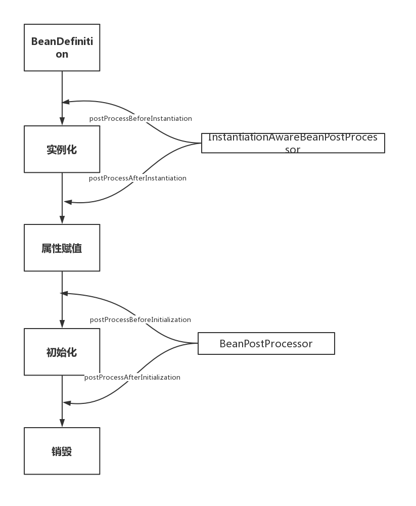

## SpringBean生命周期

SpringBean生命周期主要是分为四部分：

- ``BeanDefinition``
- 实例化
- 属性填充
- 初始化
- 销毁


Bean生命周期的扩展点：

``org.springframework.beans.factory.config.InstantiationAwareBeanPostProcessor``

``org.springframework.beans.factory.config.BeanPostProcessor``



通过分析用工厂获取Bean的源码分析到Bean的生命周期，核心实现方法：``org.springframework.beans.factory.support.AbstractAutowireCapableBeanFactory#createBean``

```java
//仅记录关键位置
protected Object createBean(String beanName, RootBeanDefinition mbd, @Nullable Object[] args)
			throws BeanCreationException {
    RootBeanDefinition mbdToUse = mbd;
    Object bean = resolveBeforeInstantiation(beanName, mbdToUse);
    Object beanInstance = doCreateBean(beanName, mbdToUse, args);
    return beanInstance;
}
```

resolveBeforeInstantiation 中调用该方法，在bean实例化之前进行调用

```java
protected Object applyBeanPostProcessorsBeforeInstantiation(Class<?> beanClass, String beanName) {
    for (BeanPostProcessor bp : getBeanPostProcessors()) {
        if (bp instanceof InstantiationAwareBeanPostProcessor) {
            InstantiationAwareBeanPostProcessor ibp = (InstantiationAwareBeanPostProcessor) bp;
            Object result = ibp.postProcessBeforeInstantiation(beanClass, beanName);
            if (result != null) {
                return result;
            }
        }
    }
    return null;
}
```

接下来进入创建Bean的方法：`org.springframework.beans.factory.support.AbstractAutowireCapableBeanFactory#doCreateBean`

```java
protected Object doCreateBean(final String beanName, final RootBeanDefinition mbd, final @Nullable Object[] args)
			throws BeanCreationException {
   //实例化
   BeanWrapper instanceWrapper = createBeanInstance(beanName, mbd, args);
   //属性数据填充
   populateBean(beanName, mbd, instanceWrapper);
   Object exposedObject = bean;
   //初始化Bean
   exposedObject = initializeBean(beanName, exposedObject, mbd);
}
```

在填充数据的方法中`populateBean()`会调用bean实例化之后的相关操作

```java
//将Bean属性设置到生成的实例对象上
	protected void populateBean(String beanName, RootBeanDefinition mbd, @Nullable BeanWrapper bw) {
		...
		if (!mbd.isSynthetic() && hasInstantiationAwareBeanPostProcessors()) {
			for (BeanPostProcessor bp : getBeanPostProcessors()) {
				if (bp instanceof InstantiationAwareBeanPostProcessor) {
					InstantiationAwareBeanPostProcessor ibp = (InstantiationAwareBeanPostProcessor) bp;
					if (!ibp.postProcessAfterInstantiation(bw.getWrappedInstance(), beanName)) {
						continueWithPropertyPopulation = false;
						break;
					}
				}
			}
		}
		...
		boolean hasInstAwareBpps = hasInstantiationAwareBeanPostProcessors();
		boolean needsDepCheck = (mbd.getDependencyCheck() != RootBeanDefinition.DEPENDENCY_CHECK_NONE);
		if (hasInstAwareBpps || needsDepCheck) {
			if (pvs == null) {
				pvs = mbd.getPropertyValues();
			}
			PropertyDescriptor[] filteredPds = filterPropertyDescriptorsForDependencyCheck(bw, mbd.allowCaching);
			if (hasInstAwareBpps) {
				for (BeanPostProcessor bp : getBeanPostProcessors()) {
					if (bp instanceof InstantiationAwareBeanPostProcessor) {
						InstantiationAwareBeanPostProcessor ibp = (InstantiationAwareBeanPostProcessor) bp;
						pvs = ibp.postProcessPropertyValues(pvs, filteredPds, bw.getWrappedInstance(), beanName);
						if (pvs == null) {
							return;
						}
					}
				}
			}
			if (needsDepCheck) {
				checkDependencies(beanName, mbd, filteredPds, pvs);
			}
		}
		if (pvs != null) {
			//对属性进行注入
			applyPropertyValues(beanName, mbd, bw, pvs);
		}
	}
```

填充之后初始化bean： `initializeBean` 中会调用后置处理器的初始化前置操作

```java
protected Object initializeBean(final String beanName, final Object bean, @Nullable RootBeanDefinition mbd) {
		//JDK的安全机制验证权限
		if (System.getSecurityManager() != null) {
			//实现PrivilegedAction接口的匿名内部类
			AccessController.doPrivileged((PrivilegedAction<Object>) () -> {
				invokeAwareMethods(beanName, bean);
				return null;
			}, getAccessControlContext());
		}
		else {
			//为Bean实例对象包装相关属性，如名称，类加载器，所属容器等信息
			invokeAwareMethods(beanName, bean);
		}

		Object wrappedBean = bean;
		//对BeanPostProcessor后置处理器的postProcessBeforeInitialization
		//回调方法的调用，为Bean实例初始化前做一些处理
		if (mbd == null || !mbd.isSynthetic()) {
			wrappedBean = applyBeanPostProcessorsBeforeInitialization(wrappedBean, beanName);
		}

		//调用Bean实例对象初始化的方法，这个初始化方法是在Spring Bean定义配置
		//文件中通过init-method属性指定的
		try {
			invokeInitMethods(beanName, wrappedBean, mbd);
		}
		catch (Throwable ex) {
			throw new BeanCreationException(
					(mbd != null ? mbd.getResourceDescription() : null),
					beanName, "Invocation of init method failed", ex);
		}
		//对BeanPostProcessor后置处理器的postProcessAfterInitialization
		//回调方法的调用，为Bean实例初始化之后做一些处理
		if (mbd == null || !mbd.isSynthetic()) {
			wrappedBean = applyBeanPostProcessorsAfterInitialization(wrappedBean, beanName);
		}

		return wrappedBean;
	}
```


### BeanDefinition

上下文启动时会将bean注册在IOC容器中`org.springframework.beans.factory.support.DefaultListableBeanFactory#beanDefinitionMap`

`BeanDefinition` 是对Bean相关新消息的解析，合并父类定义的源码缓存位置是：

`org.springframework.beans.factory.support.AbstractBeanFactory#mergedBeanDefinitions`


### InitializingBean

bean的初始化的扩展接口，实现了该接口的bean会在初始化阶段调用。

```java
public interface InitializingBean {
	void afterPropertiesSet() throws Exception;
}
```


### DisposableBean

bean的销毁的扩展接口，实现了该接口的bean会在销毁阶段调用。具体可查看：``ConfigurableApplicationContext#close()``

```java
public interface DisposableBean {
	void destroy() throws Exception;
}
```


### InstantiationAwareBeanPostProcessor

bean实例化阶段的扩展点，会在bean实例化前后被调用植入相关逻辑。

```java

public interface InstantiationAwareBeanPostProcessor extends BeanPostProcessor {
	@Nullable
	default Object postProcessBeforeInstantiation(Class<?> beanClass, String beanName) throws BeansException {
		return null;
	}
    
	default boolean postProcessAfterInstantiation(Object bean, String beanName) throws BeansException {
		return true;
	}
	@Nullable
	default PropertyValues postProcessPropertyValues(
			PropertyValues pvs, PropertyDescriptor[] pds, Object bean, String beanName) throws BeansException {
		return pvs;
	}

}
```

### BeanPostProcessor

在bean初始化之前后被调用植入逻辑。

```java

public interface BeanPostProcessor {

	//为在Bean的初始化前提供回调入口
	@Nullable
	default Object postProcessBeforeInitialization(Object bean, String beanName) throws BeansException {
		return bean;
	}

	//为在Bean的初始化之后提供回调入口
	@Nullable
	default Object postProcessAfterInitialization(Object bean, String beanName) throws BeansException {
		return bean;
	}

}
```

### Aware

spring定义的标记性对象感知接口，实现一些继承该接口的接口可以持有感知对象。

#### Aware实现1

Aware接口有两种实现，早期是在bean初始化之后直接通过ifelse判断然后直接调用方法，如以下接口：

`BeanNameAware`、`BeanClassLoaderAware`、`BeanFactoryAware`

```java
private void invokeAwareMethods(final String beanName, final Object bean) {
    if (bean instanceof Aware) {
        if (bean instanceof BeanNameAware) {
            ((BeanNameAware) bean).setBeanName(beanName);
        }
        if (bean instanceof BeanClassLoaderAware) {
            ClassLoader bcl = getBeanClassLoader();
            if (bcl != null) {
                ((BeanClassLoaderAware) bean).setBeanClassLoader(bcl);
            }
        }
        if (bean instanceof BeanFactoryAware) {
            ((BeanFactoryAware) bean).setBeanFactory(AbstractAutowireCapableBeanFactory.this);
        }
    }
}
```

#### Aware实现2

实现1这种编程方式明显不利于扩展，新增一种扩展Aware还需要改动主流程的代码。所以后续增加的Aware接口可以猜测是使用``BeanPostProcessor#postProcessBeforeInitialization`` 。

- EnvironmentAware 
- EmbeddedValueResolverAware  支持spel表达式
- ApplicationContextAware(ApplicationEventPublisherAware/EnvironmentAware/MessageSourceAware/)

ApplicationContext接口签名方便记忆Aware对象

```java
public interface ApplicationContext extends EnvironmentCapable, ListableBeanFactory, HierarchicalBeanFactory,
		MessageSource, ApplicationEventPublisher, ResourcePatternResolver {
```

通过查找源码发现以上的所有Aware对象都是通过``ApplicationContextAwareProcessor``后置处理器进行植入的。

``org.springframework.context.support.ApplicationContextAwareProcessor#postProcessBeforeInitialization``

#### ApplicationContextAwareProcessor

`ApplicationContextAwareProcessor`对象是如何初始化的呢？

在spring上下文启动时会调用refresh()中在创建完成之后会调用针对工厂的一些准备：``AbstractApplicationContext#prepareBeanFactory``。此处会添加后置处理器用于后续。

```java
protected void prepareBeanFactory(ConfigurableListableBeanFactory beanFactory) {
		// Tell the internal bean factory to use the context's class loader etc.
		beanFactory.setBeanClassLoader(getClassLoader());
		beanFactory.setBeanExpressionResolver(new StandardBeanExpressionResolver(beanFactory.getBeanClassLoader()));
		beanFactory.addPropertyEditorRegistrar(new ResourceEditorRegistrar(this, getEnvironment()));

		// Configure the bean factory with context callbacks.
		beanFactory.addBeanPostProcessor(new ApplicationContextAwareProcessor(this));
		beanFactory.ignoreDependencyInterface(EnvironmentAware.class);
		beanFactory.ignoreDependencyInterface(EmbeddedValueResolverAware.class);
		beanFactory.ignoreDependencyInterface(ResourceLoaderAware.class);
		beanFactory.ignoreDependencyInterface(ApplicationEventPublisherAware.class);
		beanFactory.ignoreDependencyInterface(MessageSourceAware.class);
		beanFactory.ignoreDependencyInterface(ApplicationContextAware.class);

		// BeanFactory interface not registered as resolvable type in a plain factory.
		// MessageSource registered (and found for autowiring) as a bean.
		beanFactory.registerResolvableDependency(BeanFactory.class, beanFactory);
		beanFactory.registerResolvableDependency(ResourceLoader.class, this);
		beanFactory.registerResolvableDependency(ApplicationEventPublisher.class, this);
		beanFactory.registerResolvableDependency(ApplicationContext.class, this);

		// Register early post-processor for detecting inner beans as ApplicationListeners.
		beanFactory.addBeanPostProcessor(new ApplicationListenerDetector(this));

		// Detect a LoadTimeWeaver and prepare for weaving, if found.
		if (beanFactory.containsBean(LOAD_TIME_WEAVER_BEAN_NAME)) {
			beanFactory.addBeanPostProcessor(new LoadTimeWeaverAwareProcessor(beanFactory));
			// Set a temporary ClassLoader for type matching.
			beanFactory.setTempClassLoader(new ContextTypeMatchClassLoader(beanFactory.getBeanClassLoader()));
		}

		// Register default environment beans.
		if (!beanFactory.containsLocalBean(ENVIRONMENT_BEAN_NAME)) {
			beanFactory.registerSingleton(ENVIRONMENT_BEAN_NAME, getEnvironment());
		}
		if (!beanFactory.containsLocalBean(SYSTEM_PROPERTIES_BEAN_NAME)) {
			beanFactory.registerSingleton(SYSTEM_PROPERTIES_BEAN_NAME, getEnvironment().getSystemProperties());
		}
		if (!beanFactory.containsLocalBean(SYSTEM_ENVIRONMENT_BEAN_NAME)) {
			beanFactory.registerSingleton(SYSTEM_ENVIRONMENT_BEAN_NAME, getEnvironment().getSystemEnvironment());
		}
	}
```


