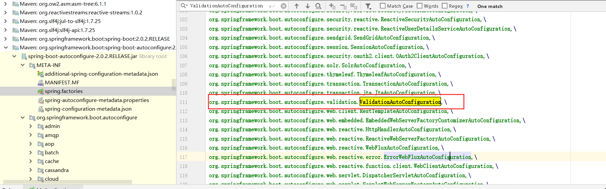

# spring-boot-validation


```java
@Configuration
@ConditionalOnClass(ExecutableValidator.class)
@ConditionalOnResource(resources = "classpath:META-INF/services/javax.validation.spi.ValidationProvider")
@Import(PrimaryDefaultValidatorPostProcessor.class)
public class ValidationAutoConfiguration {

	@Bean
	@Role(BeanDefinition.ROLE_INFRASTRUCTURE)
	@ConditionalOnMissingBean(Validator.class)
	public static LocalValidatorFactoryBean defaultValidator() {
		LocalValidatorFactoryBean factoryBean = new LocalValidatorFactoryBean();
		MessageInterpolatorFactory interpolatorFactory = new MessageInterpolatorFactory();
		factoryBean.setMessageInterpolator(interpolatorFactory.getObject());
		return factoryBean;
	}

	@Bean
	@ConditionalOnMissingBean
	public static MethodValidationPostProcessor methodValidationPostProcessor(
			Environment environment, @Lazy Validator validator) {
		MethodValidationPostProcessor processor = new MethodValidationPostProcessor();
		boolean proxyTargetClass = environment
				.getProperty("spring.aop.proxy-target-class", Boolean.class, true);
		processor.setProxyTargetClass(proxyTargetClass);
		processor.setValidator(validator);
		return processor;
	}

}
```

自动装配：

> \repository\org\springframework\boot\spring-boot-autoconfigure\2.0.2.RELEASE\spring-boot-autoconfigure-2.0.2.RELEASE.jar!\META-INF\spring.factories



### apache common bean validator


